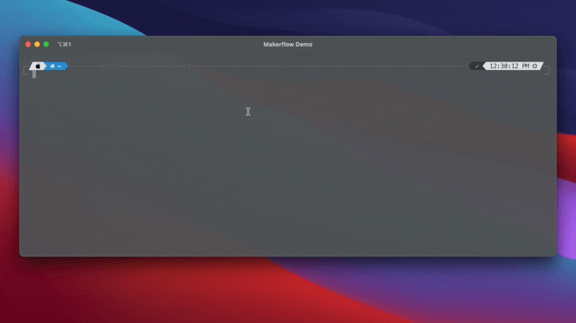
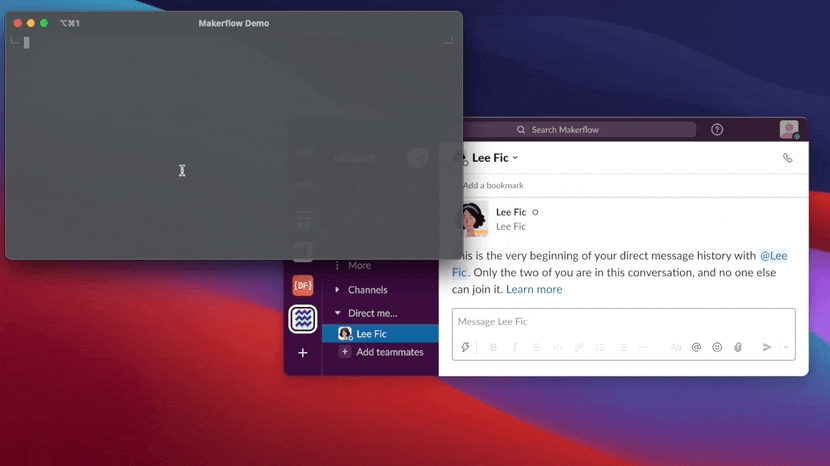
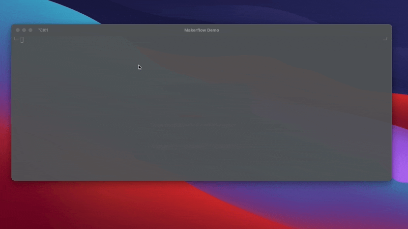

# Makerflow 💻 🌊

Makerflow is a deep work  and collaboration assistant for developers. Get in the zone without 
hiding away from your product manager, designer or other developers on the team!

## Table of contents

1. [Features](#features)
1. [Installation](#installation)
1. [Usage](#usage)
   1. [Flow Mode](#flow-mode)
   1. [Tasks](#tasks)
   1. [Breaks](#breaks)
   1. [Events (from Google Calendar)](#events-from-google-calendar)

## Features

#### With a [single command](#flow-mode) (`makerflow toggle`):
1. 🔕 Toggle "Do Not Disturb" mode on macOS.
1. 🙅 Close/open distracting chat apps like Slack, Discord, MS Teams, Telegram, WhatsApp, and Messages.
1. 🛑 Block/unblock distracting websites with the help of Makerflow [Chrome](https://chrome.google.com/webstore/detail/codmnedpgifnlanopnolihpobepaafic) or [Firefox](https://addons.mozilla.org/en-US/firefox/addon/makerflow/) extensions
1. 💬 Update/clear your Slack status automatically to let your co-workers know when 
   1. you are trying to do deep work and will be slow to respond. Status is set to 💻
   1. or, when you are on a [break](#breaks). Status is set to one of these emojis ☕️ 🍵 🥪 🥤 🚶 🏃 💪 🏥 👶 ⏸ ([more info](#providing-type-of-break))

#### Plus, other commands to
1. 📋 Get a list of your [tasks](#tasks) (`makerflow tasks todo`) like
   1. Slack notifications
   1. pull requests from GitHub or Bitbucket
1. ✅ and mark them as done (`makerflow tasks done`)
1. 📅 Interact with [events from Google Calendar](#events-from-google-calendar) by
   1. listing them (`makerflow events list`)
   1. or, joining them (`makerflow events join`)

## Installation

Install with `npm install -g makerflow-cli`

Once installed, run
1. `makerflow config token` to set your API token.
2. `makerflow config kill` to set which apps are automatically closed when Flow Mode is started and reopened 
when it is ended

### Pre-requisites

1. MacOS. 
1. A free Makerflow account. Sign up at https://makerflow.co
1. API token from https://app.makerflow.co/settings#api

## Usage

Get a list of available commands with `makerflow --help`

Run any available command with the `--help` flag to get more usage details about it.
For example, run `makerflow toggle --help` to get usage information about the `toggle` command

### Flow Mode

Starting Flow Mode will: 
1. 🔕 Turn on "do-not-disturb" mode on macOS to block your notifications and 
   prevent distractions.
1. 💬 If you have your Slack workspace connected to Makerflow, it will automatically set your 
   Slack status to let your teammates know you might be slow to respond.
1. 🙅 Close distracting chat apps like Slack, Discord, MS Teams, Telegram, WhatsApp, and Messages
   1. Once, if you ran `makerflow toggle --kill`
   1. Everytime, if you configured it to do so with `makerflow config kill`
1. 🛑 Block distracting websites if you have Makerflow [Chrome](https://chrome.google.com/webstore/detail/codmnedpgifnlanopnolihpobepaafic) or [Firefox](https://addons.mozilla.org/en-US/firefox/addon/makerflow/) extensions installed.

Stopping Flow Mode will reverse all the above actions.

#### Commands
`makerflow toggle` - Start/stop Flow Mode

`makerflow toggle --kill` - Start/stop Flow Mode and close/open chat apps. Only apps that were closed at the time of starting Flow Mode are reopened.

#### Demo

### Tasks

Tasks show up in Makerflow by connecting with your other collaboration tools like Slack, GitHub or Bitbucket.

You can connect these tools with Makerflow from the "[Setup Integrations](https://app.makerflow.co/integrations)" page on the website.

#### Commands

`makerflow tasks todo` - See a list of pending tasks like messages in Slack or pull requests from GitHub/Bitbucket.

`makerflow tasks done` - list notifications/pull requests and mark one or more tasks as done

#### Demo

### Breaks

Breaks are a quick way to set your Slack status and let your coworkers know when you are 
away on a break.

To go on a break, run `makerflow break start` and to end it, run `makerflow break stop`.

##### Providing type of break

If you pass a `--reason` argument, Makerflow will automatically set an appropriate status and emoji 
for you on Slack. For instance, if you run `makerflow break start --reason=lunch`, it will set 🥪 
emoji as your status icon. If you don't supply a reason, your status will be set to ⏸.

Reasons currently supported are lunch (🥪), coffee (☕️), tea (🍵), beverage (🥤), walk (👟), run (🏃), workout (💪), 
child (👶), and doctor (🏥).

##### Commands

`makerflow break start` - Start a beak. Sets your Slack status emoji to ⏸

`makerflow break start --reason=<type>` - Start a break with a specific reason. Supported values for reason are one of `lunch`, `coffee`, `tea`, `beverage`, `walk`, `run`, `workout`, `child`, `doctor`

`makerflow break stop` - Finish your break. Slack status is cleared.

#### Demo

### Events (from Google Calendar)

Interact with events from connected Google Calendars. You can your calendars with Makerflow from the 
"[Setup Integrations](https://app.makerflow.co/integrations)" page on the website.

#### Commands
`makerflow events list` - will list recently ended, ongoing and upcoming events from Google Calendar.
`makerflow events join` - will open a currently ongoing event's, or, the next upcoming event's Google Meet

#### Demo

## Upcoming

Makerflow VS Code plugin is coming soon to trigger "Flow Mode" automatically or from the command palette.
